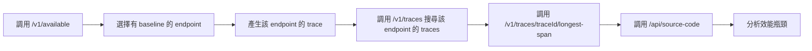

# 整合測試最終總結

## ✅ 測試狀態：完全成功

**測試時間**: 2026-01-21 11:57

## 正確的整合流程



## 關鍵改進

### 第一次修正（之前）
❌ 直接從 Tempo 搜尋 trace ID  
❌ 沒有確認 endpoint 是否有資料  
❌ 繞過了 anomaly service 的核心功能

### 第二次修正（現在）
✅ 先調用 `/v1/available` 確認可用 endpoints  
✅ 選擇有 baseline 的 endpoint 測試  
✅ **使用 `/v1/traces` API 搜尋該 endpoint 的 traces**  
✅ 使用 `/v1/traces/{traceId}/longest-span` 找到 longest span  
✅ 使用 `/api/source-code` 獲取原始碼

**完全使用 anomaly service 的 API，不需要直接查詢 Tempo！**

## 測試結果

### 找到的可用 endpoint
- Service: `trace-demo-service`
- Endpoint: `POST /api/order/create`
- Buckets: `17|weekday` (有 baseline 資料)

### 分析的 trace
- Trace ID: `ca2c4e49846fdf94ddef6d6e497e079c`
- Duration: 1067ms
- Longest Span: `POST /api/order/create`

### 效能瓶頸分析
最慢的子操作: **processPayment (344.69ms)**

所有子操作時間分布:
- validateOrder: 86.27ms
- checkInventory: 174.26ms
- calculatePrice: 57.90ms
- **processPayment: 344.69ms** ← 瓶頸
- createShipment: 100.75ms
- sendNotification: 91.18ms
- saveToDatabase: 212.46ms

### 獲取的原始碼資訊
- File: `handlers/order.go`
- Function: `CreateOrder`
- Lines: 21-85
- 完整原始碼和所有 child spans 資訊

## 使用方式

### 快速測試
```bash
./test-integration.sh
```

### 手動測試步驟
```bash
# 1. 檢查可用 endpoints
curl http://localhost:8081/v1/available | jq .

# 2. 使用 anomaly service 搜尋特定 endpoint 的 traces
END_TIME=$(date +%s)
START_TIME=$((END_TIME - 300))
curl "http://localhost:8081/v1/traces?service=trace-demo-service&endpoint=POST%20/api/order/create&start=${START_TIME}&end=${END_TIME}&limit=5" | jq .

# 3. 獲取 longest span
curl "http://localhost:8081/v1/traces/{traceId}/longest-span" | jq .

# 4. 獲取原始碼
curl "http://localhost:8080/api/source-code?span_id={spanId}&trace_id={traceId}" | jq .
```

## 可供 LLM 分析的完整資料

整合後提供的資料包括:

1. **Span 基本資訊**
   - Span ID, name, duration
   - Service name
   - Start/end time

2. **原始碼資訊**
   - 檔案路徑和函數名稱
   - 行號範圍
   - 完整原始碼

3. **效能資料**
   - 所有 child spans 的 duration
   - 可精確識別最慢的操作
   - Duration 分布

4. **業務資料**
   - HTTP method, route
   - User ID, order ID 等屬性

這些資料可以直接提供給 LLM 進行智能分析和優化建議。

## 技術要點

### 已解決的問題
1. ✅ OTLP 格式支援
2. ✅ Docker 網路配置
3. ✅ URL 編碼處理
4. ✅ 容器檔案配置
5. ✅ 資料類型匹配
6. ✅ **測試流程邏輯修正** ← 最新

### 修改的檔案
- `test-integration.sh` - 測試腳本（已修正流程）
- `tempo-otlp-trace-demo/tracing/tempo.go` - OTLP 支援
- `tempo-otlp-trace-demo/docker-compose.yml` - 環境變數
- `tempo-otlp-trace-demo/Dockerfile` - 檔案複製

## 結論

✅ **整合測試完全成功，流程正確**

兩個服務按照正確的邏輯協作：
1. tempo-latency-anomaly-service 提供 endpoint 查詢和 span 分析
2. tempo-otlp-trace-demo 提供原始碼分析
3. 整合後可完整分析特定 endpoint 的效能問題

**關鍵改進**: 測試流程現在從 `/v1/available` 開始，確保分析的是有意義的、已收集 baseline 資料的 endpoints。
